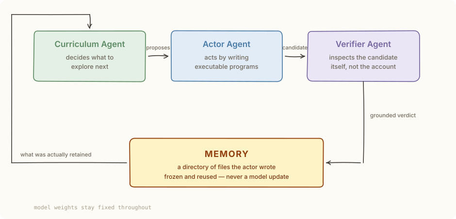
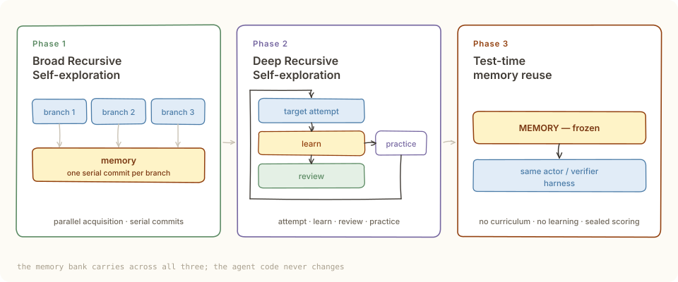
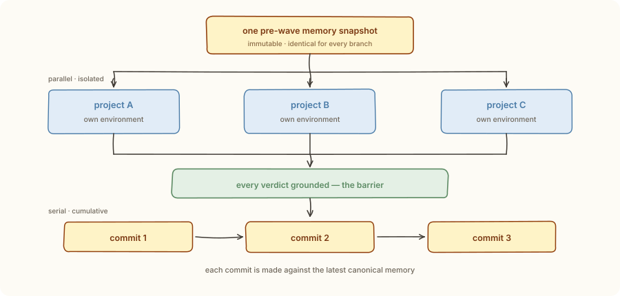
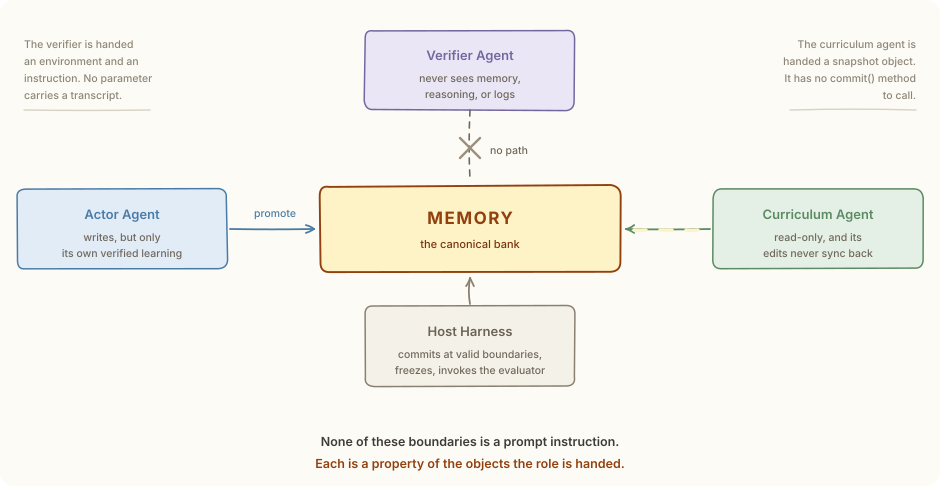

# RSIAgent

**A from-scratch Python implementation of RSIAgent** — autonomous exploration
for recursive self-improvement in new environments.

A training-free, multi-agent framework in which a **Curriculum Agent**, an
**Actor Agent**, and a **Verifier Agent** recursively explore an unfamiliar
environment and consolidate what they learn into reusable memory — without
updating model weights.

<p align="center">
  
</p>

[](https://github.com/mg1094/RSIAgent/actions/workflows/tests.yml)
[](LICENSE)
[](pyproject.toml)
[](https://arxiv.org/abs/2609.15364)

---

## Try it in ten seconds

No API key, no network, no VM — one command runs the entire three-stage
lifecycle against a real environment with real subprocesses:

```bash
pip install -e .          # optional; the demo also runs from a checkout
python examples/offline_demo/run.py
```

```
--- Phase 1 — Broad Recursive Self-exploration ----------
  [curriculum] wave 0: PROJECTS ['p-bom', 'p-delim']
    [verdict] p-bom: FAIL (1 programs)
    [verdict] p-delim: FAIL (1 programs)
  [curriculum] wave 0: SATURATED

--- Phase 2 — Deep Recursive Self-exploration ----------
  [target cycle 0] FAIL
  [curriculum] review -> PROJECT
    [practice] p-decimal: PASS
  [target cycle 1] FAIL
  [curriculum] review -> PROJECT
    [practice] p-dates: PASS
  [target cycle 2] PASS

--- Phase 3 — frozen-memory evaluation ------------------
  [frozen] 4 files, hash 23cb3a0624f7
  [official score] partial=1.0000 binary=True

STAGE COMPARISON
  RSIAgent (w/o RSI)            0.1429    1.00/7
  RSIAgent (w/o DRS)            0.4286    3.00/7
  RSIAgent (w/o BRS)            0.5714    4.00/7
  RSIAgent (Full RSI)           1.0000    7.00/7
```

The demo's environment has four discoverable format quirks. Broad exploration
finds the two that are visible from reading the directory; the other two only
bite once a real attempt produces plausible-looking wrong numbers, and deep
refinement finds those. The memory that results is four small files, and the
frozen-memory evaluation scores full marks because of them.

Read [`examples/offline_demo/`](examples/offline_demo/) to see exactly how — it
is about 400 lines and is meant to be read.

---

## The idea

> An agent can repair a mistake during one attempt and still have to discover
> the same lesson again in the next.

RSIAgent turns those interactions into persistent experience. It explores,
checks outcomes, and consolidates useful procedures into memory that subsequent
attempts reuse — **without updating model weights**.

Three roles, each with its own context and its own authority:

| Role | Does | Cannot |
| --- | --- | --- |
| **Curriculum Agent** | Chooses what to explore next; decides when practice has stopped paying | Grade candidates, or author memory |
| **Actor Agent** | Acts by writing executable programs; afterwards distills its own verified experience | See the verifier's reasoning |
| **Verifier Agent** | Inspects the real candidate and issues a grounded PASS / FAIL / UNVERIFIED | See the actor's memory, reasoning, or logs |

Two exploration stages, then reuse:

<p align="center">
  
</p>

The full procedure is paper **Algorithm A1**, implemented step for step in
[`rsiagent/rsi/protocol.py`](rsiagent/rsi/protocol.py). Every module docstring
in this repository quotes the passage of the paper it implements, so the code
and the manuscript can be read side by side.

---

## How it works

Three mechanics carry most of the design. Each is enforced by the shape of the
code rather than requested in a prompt, which is why they hold under a model
that would rather do something else.

### The wave barrier

Broad exploration acquires experience in parallel and consolidates it serially.
Every project in a wave opens on the *same* immutable snapshot and cannot see its
siblings; all verdicts must land before a single commit happens; the commits then
run one at a time, in the order the curriculum agent authored them, each against
the memory the previous one just wrote.

The split is what buys throughput without letting two branches write memory from
a stale read of it. The budget is checked *between* waves, so a wave already
underway is never truncated — the realized project count can exceed the nominal
one.

<p align="center">
  
</p>

### Who may touch memory

| Role | Access | Why it cannot do more |
| --- | --- | --- |
| Actor | writes, but only its own verified learning | work-phase edits live in a throwaway session that is discarded before learning opens a fresh one |
| Curriculum | reads a disposable copy | it is handed a snapshot object, which has no `commit()` method to call |
| Verifier | none at all | it is handed an environment and an instruction; no parameter carries a transcript |
| Host harness | promotes and freezes | it commits only at valid boundaries and records a tree hash of what it froze |

<p align="center">
  
</p>

The consequence worth stating plainly: **none of these boundaries is a prompt
instruction.** Each is a property of the objects the role is handed. A verifier
that wanted to read the actor's reasoning has no parameter through which to
receive it.

### Unresolved is not a verdict

The verifier can return `UNVERIFIED`, and the protocol treats it as blocking
rather than as a soft PASS. It grounds no learning, it does not advance a phase,
and it is never recorded as convergence. Likewise `STALLED` — which buys one
final target attempt — stays distinguishable from a completed lifecycle, and an
infrastructure failure is unscored rather than an official zero.

---

## Running for real

```bash
pip install -e .            # or just put the repo on PYTHONPATH
cp .env.example .env        # fill in OPENAI_API_KEY (any OpenAI-compatible host)
```

Write a task and an evaluator:

```python
# my_task.py
from rsiagent.tasks.spec import ScriptedEvaluator, TaskQuery

task = TaskQuery(
    id="repair-report",
    instruction="Repair `work/report.xlsx` so every formula evaluates to a number.",
    fixtures={"work/report.xlsx": open("seed/report.xlsx", "rb").read().decode("latin-1")},
)


def _formulas_resolve(environment) -> float:
    ...
    return 1.0


evaluator = ScriptedEvaluator({"formulas_resolve": _formulas_resolve})
```

```bash
rsiagent run --task my_task.py:task --evaluator my_task.py:evaluator --arm rsi
rsiagent inspect runs/latest
rsiagent memory  runs/latest
```

`--arm` selects the paper's stage-ablation conditions:

| `--arm` | Stages | Paper condition |
| --- | --- | --- |
| `baseline` | eval only, no memory | `RSIAgent (w/o RSI)` |
| `brs-only` | BRS + eval | `w/o DRS` |
| `drs-only` | DRS + eval | `w/o BRS` |
| `rsi` / `full` | all three | Full RSI |

### Running without a model

To watch the protocol before spending a token on it, supply the three roles as
plain functions with `--policies`. The lifecycle, environment, verifier
checkpointing, and memory commits are all real; only the text generation is
yours:

```bash
cd examples/custom_task
rsiagent run --task task.py:task --evaluator task.py:evaluator \
             --policies policies.py:policies --arm rsi --out runs/rsi
```

[`examples/custom_task/`](examples/custom_task/) is that pattern in full — the
smallest complete task, and the recommended place to start reading. It is about
120 lines and the interesting part is one line:

```python
value = "42" if MEMORY_FACT in _memory_text(messages) else "41"
```

Nothing about the model changes between the failing attempt and the passing one.
A file the actor wrote while learning from the first attempt came back in the
second attempt's prompt. That is the entire claim of the framework.

### Configuration

Every setting from the paper's Table A3 is a field with the manuscript's value
as its default:

```python
RunConfig(
    actor=RoleModelConfig(model="glm-5.3"),  # paper default
    verifier=RoleModelConfig(model="kimi-k3"),
    curriculum=RoleModelConfig(model="kimi-k3"),
    exploration=ExplorationConfig(
        brs_project_budget=8,  # nominal; checked at wave boundaries only
        brs_concurrency=4,  # concurrency limit, not a wave width
        stop_policy="curriculum_review",  # vs "verifier_pass"
    ),
    limits=ExecutionLimits(target_iterations=500, program_timeout_s=600.0),
)
```

`rsiagent validate config.json` checks a configuration without running it.

---

## Using a different environment

The paper drives a QEMU-backed Ubuntu guest. Nothing in the RSI protocol needs
one — it needs an environment it can **reset**, **execute programs in**,
**snapshot**, and **restore**. Implement
[`rsiagent.env.base.Environment`](rsiagent/env/base.py) and the whole lifecycle
runs against a container, a VM, or a remote sandbox instead:

```python
class MyEnvironment(Environment):
    def reset(self): ...
    def execute(self, program, *, kind="python", timeout=None) -> ExecResult: ...
    def observe(self, hint="") -> Observation: ...
    def list_files(self, subdir="") -> list[str]: ...
    def read_bytes(self, relpath) -> bytes: ...
    def exists(self, relpath) -> bool: ...
    def write_fixture(self, relpath, content): ...
    def snapshot(self, label) -> str: ...
    def restore(self, checkpoint_id): ...
    def discard(self, checkpoint_id): ...
```

> [!WARNING]
> The bundled `LocalWorkspaceEnvironment` executes **model-authored Python and
> shell programs on the host**, with your privileges. That is its purpose — it
> is the drop-in replacement for the paper's VM — but it is not a security
> boundary. Point it only at work you control, or implement a container-backed
> `Environment` first.

---

## Documentation

| Document | Contents |
| --- | --- |
| [`docs/ARCHITECTURE.md`](docs/ARCHITECTURE.md) | Module map, the role boundaries, and why each is enforced structurally |
| [`docs/PAPER_MAPPING.md`](docs/PAPER_MAPPING.md) | Paper section / Algorithm / Prompt → the code that implements it |
| [`examples/custom_task/`](examples/custom_task/) | Smallest complete task, end to end |
| [`examples/offline_demo/`](examples/offline_demo/) | The full lifecycle with a discoverable environment |
| [`CONTRIBUTING.md`](CONTRIBUTING.md) | Setup, and what this project considers a good change |
| [`SECURITY.md`](SECURITY.md) | Read before pointing this at a real model |

Every module docstring quotes the passage of the paper it implements, so the
code and the manuscript can be read side by side.

---

## Testing

```bash
pip install -e ".[dev]"
pytest            # 95 tests, ~17s, no API key, no network
ruff check . && ruff format --check .
```

Or `make test` / `make lint`.

The tests run real environments and real subprocesses, so they cover the paths a
benchmark run takes rather than mocks of them. The suite is organised around the
invariants that are easy to get subtly wrong:

| File | Pins |
| --- | --- |
| `test_phase1_wave.py` | The wave barrier: shared snapshots, serial cumulative commits, budget checked between waves, blocked waves |
| `test_phase2_stop_policy.py` | `curriculum_review` vs `verifier_pass`, STALLED ≠ convergence, unresolved outcomes grounding no learning |
| `test_harness.py` | Checkpoint-protected verification, revision-on-FAIL, the verifier's information boundary |
| `test_memory.py` | Memory ownership: work-phase edits discarded, commits promoted, frozen memory read-only |
| `test_learning.py` | Distillation → reconciliation → diagnosis, and refusal to learn from UNVERIFIED |
| `test_cli.py` | The documented `run` / `inspect` / `memory` / `validate` paths |
| `test_offline_demo.py` | End-to-end: the whole lifecycle, four times, with the paper's stage ordering |

CI runs all of it on Python 3.10, 3.11, and 3.12, plus the two documented
examples.

---

## Related work

Two neighbouring lines of work are worth naming, plus one pointer. Only the
first is implemented here.

**RSIAgent** — Zhu, Fan, Wang, Wu, Zhou, Huang.
*RSIAgent: Autonomous Exploration for Recursive Self-improvement in New
Environments.* [arXiv:2609.15364](https://arxiv.org/abs/2609.15364), 2026.
[Website](https://aetherlabsai.github.io/RSIAgent/).

> **This is what the code in this repository implements.** Three agents —
> curriculum, actor, verifier — explore a new environment under a
> broad-then-deep strategy, check what they learn against execution, and freeze
> the resulting memory for downstream tasks. Model weights never change.

**Dream-RSI** — Zheng, Wu, Zhang, He, Zhang, Coleman, Wei, Bai, Liu, Liu, Wang,
Zhuan, Kang, Xiang, Huang, Cheng, Guo.
*Dream-RSI: Recursive Self-Improvement through Evolving Worlds.* 2026.
[Website](https://dream-rsi.com/).

> **Not implemented here.** The two improve different objects. RSIAgent improves
> the *agent's knowledge of the environment* by accumulating memory. Dream-RSI
> improves the *exploration procedure itself*: a completed discovery tree is
> reused as an exact replay simulator over the search space it already reached,
> so thousands of candidate policies can be scored offline at zero executions,
> and only the winner is redeployed. One learns what the environment is like;
> the other learns how to search it.

**Retrieve-for-Train** — Google Research.
*Bypassing inference bottlenecks: accelerating complex AI search with
Retrieve-for-Train.*
[Blog post](https://research.google/blog/bypassing-inference-bottlenecks-accelerating-complex-ai-search-with-retrieve-for-train/).

> **Not implemented here, and not summarised here** — listed as a pointer to a
> related approach to making search-based discovery cheaper. Consult the post
> itself; this repository makes no claims about its method.

---

## Provenance

This is an independent reimplementation of the framework in:

> Sibo Zhu, Shicheng Fan, Xinyue Wang, Wenyi Wu, Kun Zhou, Biwei Huang.
> *RSIAgent: Autonomous Exploration for Recursive Self-improvement in New
> Environments.* arXiv:2609.15364, 2026.

It was written from the paper, the project website, and the authors' public
documentation of the architecture. No source code from the reference
implementation was copied; the module layout, class design, and every line here
are original. Where this repository quotes the paper — in docstrings, and in the
prompt templates under `rsiagent/prompts/` — the quotation is marked.

The implementation focuses on the framework's algorithmic core. The original
project's benchmark integrations (OSWorld 2.0 and Agents' Last Exam, with their
QEMU images, guest transport, and sealed graders) are *not* reproduced; the
`Environment`, `Evaluator`, and `LLMClient` protocols are the seams where a
benchmark adapter or a different model provider attaches.

## Repository layout

```text
rsiagent/
  config.py        RunConfig and the paper's Table A3 defaults; the stage switch
  status.py        Verdict · Decision · TerminalStatus · Phase
  parsing.py       Model output → protocol state
  llm/             Model transport: OpenAI-compatible, Anthropic, offline
  env/             The Environment protocol and a local implementation
  memory/          The bank, snapshots, sessions, freezing, tree hashing
  prompts/         Every role's prompt, with the paper's quotes marked
  tasks/           TaskQuery · Project · TaskScore · the sealed Evaluator
  agents/          Contexts, and the actor / verifier / curriculum agents
  learning/        Distillation → reconciliation → diagnosis
  runtime/         The action–verification harness, and the journal
  rsi/             phase1_brs · phase2_drs · phase3_eval · protocol (A1)
  cli.py           The command line
examples/          custom_task (smallest) · offline_demo (full lifecycle)
docs/              ARCHITECTURE.md · PAPER_MAPPING.md · assets/ (figures)
tests/             95 tests, no API key required
```

---

## Status and scope

**What works:** the full Algorithm A1 lifecycle, the four stage-ablation
conditions, memory ownership and freezing, a runnable offline demo, and a CLI.

**What is deliberately not here:** the benchmark integrations. Reproducing the
paper's reported scores needs OSWorld 2.0 and Agents' Last Exam — their VM
images, guest transport, and sealed graders — which are large, separately
licensed, and tied to a specific host setup. The `Environment`, `Evaluator`, and
`LLMClient` protocols are the seams where such an adapter attaches; a PR adding
one is welcome.

**What this has never done:** been run against a frontier model. Every execution
path is exercised by the test suite against deterministic policies, and the
model clients are the same shape those policies mock, but a real-model run has
not been performed here. If you do one, the results are interesting — the
journal is designed to be read.

Two deliberate departures are worth naming:

- **The examples' model roles are deterministic policies, not language models.**
  They exist so the protocol can be exercised offline. A demo score demonstrates
  that the lifecycle runs and that memory changes behaviour; it says nothing
  about model capability, and no number in this repository is comparable to a
  benchmark result in the paper.
- **`LocalWorkspaceEnvironment` is a convenience, not a reproduction** of the
  paper's isolated guest. It gives up isolation for portability. Read
  [`SECURITY.md`](SECURITY.md) before pointing it at a real model.

If you use the ideas here, cite the original paper.

## License

Apache License 2.0. See [`LICENSE`](LICENSE) and [`NOTICE`](NOTICE).
